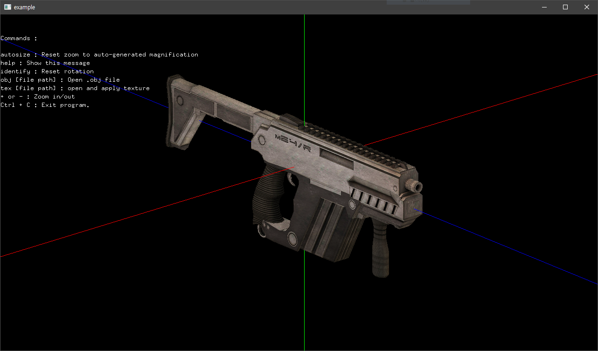

# 부경대학교 IT융합응용공학과 2019학년도 텀프로젝트
---

## 참가 조원

* 201512135 정상우
* 201613491 김우찬

## 기능

* .obj파일의 폴리곤 정보를 읽고 3d로 렌더링
* 노말정보가 없는 vertex의 경우 폴리곤 면 기반 노말정보 생성 후 대입
* 단일 텍스쳐 로드 기능 지원
* 내부 콘솔명령 지원
* 카메라와 같이 움직이는 조명

## 사용법
* 마우스 드래그로 회전
* `+`,`-` 키로 확대/축소
* `Ctrl`+`C` 종료
* 명령어
	* `help` : 명령어 리스트 확인
	* `obj (파일 경로)` : .obj파일 로드
	* `identify` : 회전 초기화
	* `autosize` : 자동확대로 초기화
	* `tex (파일 경로)` : 텍스쳐 파일 로드
	
## 참고

* [Sean Barrett](https://github.com/nothings)의 [이미지 로딩 라이브러리](https://github.com/nothings/stb/blob/master/stb_image.h)를 사용했습니다.

